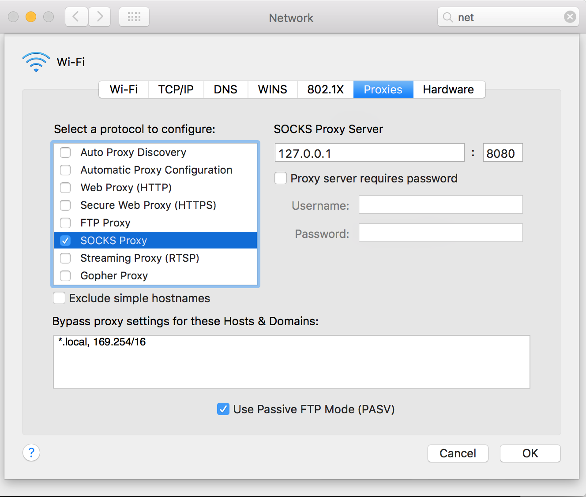

#Couchbase with Azure ARM Templates
This blog post describes how to set up your own Couchbase Cluster using Azure Resource Manager templates, aka ARM templates.

##Prerequisites: 
This post is describing how to host your own Couchbase Cluster in Microsoft Azure. If you would like to try this you will need a few things:

1. Azure Subscription, sign-up here for a [free trial](https://azure.microsoft.com/en-us/pricing/free-trial).
2. Azure CLI, installed on your system, [how to install](https://azure.microsoft.com/en-us/documentation/articles/xplat-cli-install/). 
3. [Github Account](https://github.com/), optional if you would like to experiment with your own ARM templates.

##What you will deploy
This blog post will walk you through the steps needed to deploy your own Couchbase 4.1 Cluster in Microsoft Azure. The size of the cluster is configurable but will as a minimum consist of a three node cluster set-up with replication to one node. You can also chose the data center location for Cluster between all available locations assessable with your Microsoft Azure subscription.   

In the process of deploying Couchbase to Azure you will learn about Azure Resource Manager Templates and how to edit them to fit your needs. This will allow you to change default values in the Couchbase ARM template but also understand how to use ARM templates in other cases when using Microsoft Azure.

##Azure Resource Manager templates
Azure Resource Manager allows you to provision applications to Microsoft Azure using a declarative template. With a single template, you can deploy multiple services along with their dependencies. You also have the option to split up your ARM templates into multiple templates that each describe individual resources. You can use the same templates individually or separately to repeatedly deploy your application/resources during every stage of the application lifecycle.

You can compare ARM templates to other resource description technologies like [chef.io](https://docs.chef.io/resource_template.html) or others.

Here is an example of the most simple ARM template:

```
{
   "$schema": "http://schema.management.azure.com/schemas/2015-01-01/deploymentTemplate.json#",
   "contentVersion": "",
   "parameters": {  },
   "variables": {  },
   "resources": [  ],
   "outputs": {  }
}
``` 

ARM templates are written in JSON with the option to use some special formatted strings that can work as references to variables and/or method calls. 

The ARM template snippet below shows how to define a virtual network and the use of `variables` and `parameters` in an ARM template.

```
{
      "apiVersion": "2015-05-01-preview",
      "type": "Microsoft.Network/virtualNetworks",
      "name": "[variables('virtualNetworkName')]",
      "location": "[variables('location')]",
      "properties": {
        "addressSpace": {
          "addressPrefixes": [
            "[variables('addressPrefix')]"
          ]
        },
        "subnets": [
          {
            "name": "[variables('subnetName')]",
            "properties": {
              "addressPrefix": "[variables('subnetPrefix')]"
            }
          }
        ]
      }
    },
```

You can read more about how to author ARM templates from the Microsoft [Azure documentation](https://azure.microsoft.com/en-us/documentation/articles/resource-group-authoring-templates/). 

It also possible to execute external code like shell scripts etc. to allow for custom configuration, installation directly on a Virtual Machine as part of the set-up process.

In combination all this allows for a very fine grained configuration and set-up of resources in Azure. 
The above ARM template snippet is taken from the [Couchbase Cluster ARM template](https://github.com/martinesmann/couchbase-azure/tree/master/src/templates) on GitHub. 

The option to execute scripts on the VM is used to install and configure Couchbase Server on each individual VM and then lastly set-up the Couchbase Cluster between the individual Couchbase nodes. 

```
 "vmScripts": {
      "scriptsToDownload": [
        "[concat(variables('templateBaseUrl'), 'couchbase-azure-install.sh')]",
        "[concat(parameters('cbPackageDownloadBase'), parameters('cbPackage'))]",
        "[concat(variables('templateBaseUrl'), 'vm-disk-utils-0.1.sh')]"
      ],
      "installCommand": "[concat('bash couchbase-azure-install.sh -d ', parameters('cbPackage'), ' -n ', parameters('clusterName'), ' -i ', concat(variables('networkSettings').nodesIpPrefix, '-', variables('clusterSpec').clusterSize), ' -a ', variables('machineSettings').adminUsername, ' -p ', variables('machineSettings').adminPassword, ' -r ', variables('clusterSpec').couchbaseRamQuota)]",
      "setupCommand": "[concat('bash couchbase-azure-install.sh -d ', parameters('cbPackage'), ' -n ', parameters('clusterName'), ' -i ', concat(variables('networkSettings').nodesIpPrefix, '-', variables('clusterSpec').clusterSize), ' -a ', variables('machineSettings').adminUsername, ' -p ', variables('machineSettings').adminPassword, ' -r ', variables('clusterSpec').couchbaseRamQuota, ' -l')]"
    },
    "clusterSpec": "[variables(concat('tshirtSize', parameters('tshirtSize')))]"
``` 

The above snippet shows how to configure an external script as part of the ARM template and passing in command line arguments, using `parameters`.

We will talk more about ARM templates later.   

##Azure CLI
In the previous section we briefly learned about ARM templates and how they can be used to describe resources in Azure. A recipe for the resources and there individual configurations as need for your specific set-up.

In this section we we focus on how to use the ARM template or in Azure jargon, Deploy ARM templates. You have a few deployment options, let's briefly walk through them.

###Using Azure Portal, option 1
The new Azure portal give you an option to do "template deployment" from within the portal itself. 
By navigating to: [Microsoft.Template](https://portal.azure.com/#create/Microsoft.Template)
you can copy/paste you ARM template into the portal and execute it. The UI even support custom parameters etc.

The drawback is that you can only copy/paste one ARM template into the portal and all resources need to be with this single "file".

###Using Azure Portal, option 2
This feature is very close to "option 1" but with a few differences. It's possible to instruct Azure to download an ARM template from an external source, only requirement is that all resources (templates´, scritps etc.) are publicly available.

This feature can be seen and tested from the Microsoft Official Azure Quick Start Templates repository on GitHub, [azure-quickstart-templates](https://github.com/Azure/azure-quickstart-templates/)

If you visit this specific template[101-vm-simple-windows](https://github.com/Azure/azure-quickstart-templates/tree/master/101-vm-simple-windows) you will see a blue button (Deploy to Azure). Pushing this button will redirect you to the Azure Portal Template Deployment, but now with the template pre-pasted into the portal.

>Note! 
>
>The [azure-quickstart-templates](https://github.com/Azure/azure-quickstart-templates/) is a great resource for learning more about ARM templates.

###Azure PowerShell 
Azure PowerShell is a module for PowerShell that gives you access to execute commands agains Azure from PowerShell. You can create, test, deploy, and manage solutions and services incl ARM template deployments.

PowerShell is a great command line tool for the Windows Platform and widely used by both IT Professionals and Developers, but it's only available on Windows. 

Read more [PowerShell](https://azure.microsoft.com/en-us/documentation/articles/powershell-azure-resource-manager/)

But not everyone run Windows! That's why Microsoft has developed the Azure CLI tool.

###Azure CLI     
The Azure CLI is a command line tool for working with Microsoft Azure; build for Mac, Linux, and Windows. 
Working with a x-platform tool like Azure CLI give you the great benefit that you can use your knowlagde on all platforms.

I have chosen to use Azure CLI as it seems to have the wides audience and can be used on most platforms.

The rest of this post will assume the use of the Azure CLI, but many (if not all) commands also exists in Azure PowerShell.

###Install Azure CLI
Depending on you preferences you can install Azure CLI from a dedicated install package for your platform or using `npm`, full instructions can be found here, [Install the Azure CLI](https://azure.microsoft.com/en-us/documentation/articles/xplat-cli-install/).

Assuming you have a Mac and `npm` is already installed on your system, then installing Azure CLI is a single line:

```
sudo npm install -g azure-cli
```

Please note the use of the global install argument `-g`, this ensures that Azure CLI is globally available on the system.

##Using Azure CLI 
Now that we have Azure CLI installed let's move on and see how to use the tool to deploy and manage your Azure resources with ARM templates.

###Authentication
Before using the Azure CLI we need to authenticate against Microsoft Azure. There are multiple ways to authenticate the CLI with Azure, for a detailed guide visit [Connect to an Azure](https://azure.microsoft.com/en-us/documentation/articles/xplat-cli-connect/).

In this guide we will use this command:

```
azure login
```

*Please follow the on screen instructions to authenticate the Azure CLI.*

###Set Azure Subscription Account to use
If you have multiple Azure Subscriptions you need to select the subscription to use.

Use this command to liste the available subscriptions for the account: 

```
azure account list
```

Set the subscription you would like to use as your `default` account for all instances of the Azure CLI instance. 
```
azure account set "Azure Pass" 
```

###Set the Azure Resource Manager mode
Azure CLI can work in two different modes, classic and arm. Depending on the mode you select you will be restricted to work only with those resource types (you can always change mode later on). 

We are working with Azure Resource Manager templates and therefore we need to switch mode to `arm`. 

The default mode for Azure CLI is `classic`, use the following command to enable Azure Resource Manager mode:

```
azure config mode arm
```

###Create a Resource Group
When working with Azure Resource Manager you always work within a "resource group". You can think of a "resource group as a bucket, container or logical area for your resources. The resource group encapsulates all the resources need for your application and makes it easy to define boundaries between resources.

A resource group needs to be created within a location (Azure region).

Depending on your subscription the available location can vary. To get the complet list for you subscription run the following command:

```
azure location list
``` 

Pick a location for your resource group and create a resource group:
 
```
azure group create -n CB_RESOURCE_GROUP -l "Eest US"
```

###Create a deployment and wait for success
With a resource group created we can "deploy" a ARM template to the resource group. This will create all the resources defined in the ARM template to resource group.

The below command will "send" the ARM template to Azure and start the deployment of the defined resources to the specified resource group. 

>Important!
>
>This command will create a three node cluster on your subscription and with that start consumption/usage on your Azure subscription. Depending on your subscription type, level etc. this may put charges on you subscription that you may be billed for later! 


```
azure group deployment create \
	--template-uri https://raw.githubusercontent.com/martinesmann/couchbase-azure/master/src/templates/azuredeploy.json \
    -e azuredeploy.parameters.json \
    CB_RESOURCE_GROUP \
    AZURE_DEPLOYMENT
```

Let me explain the command in a bit more detail.
The `\` is only added to allow line breaks for a single line command in the console. This is not specific to Azure CLI.

The first line instructs Azure CLI to create a new deployment.

Second line is the reference to the ARM template, this value can be both a local file or (as in this case) a reference to a public location.

ARM templates need parameters and variables, the third line instructs Azure CLI where to find the parameters. You can also add parameters directly from the command line, but I find it more convenient to use a file. 
It's worth noting that when using a parameters file it needs to be local, on you machine. I guess this restriction is enforced by Microsoft to ensure security and no accidental sharing of sensitive data.

Execution time for the above command is about 10-25 minutes. Therefore if you need a cop of coffee, now would be a good time to get that :)


###Public IP for Resource Group
Ones the deployment is completed and succeeded it's time to inspect the result.

You can always navigate to the [Azure Portal](https://portal.azure.com) to get a visual of what has been deployed, but we can also use Azure CLI.

The Couchbase ARM template actually create four virtual machines! Three Couchbase nodes combined to a single cluster and one virtual machine set-up as a `jump box`. The set-up is the recommended best practice from Couchbase and ensures that the Couchbase Cluster is protected behind a firewall and can only be "directly" access though the jump box machine.

Actually the security configuration set-up by the ARM template is really elegant, none of the Couchbase nodes have a public IP. This means that there is no way to access the nodes without going through the jump box! Perfect.

We can confirm this by asking Azure CLI to return ALL public IP's assigned for our resource group.
 
```
azure network public-ip list CB_RESOURCE_GROUP
```

We can now use this IP to create an ssh tunnel to our Couchbase Cluster.

```
[MAC ONLY]
ssh -D 8080 -C -N couchadmin@{ip-address}
```

>Info:
>
>If you used the default parameters then:
>User: couchadmin
>Password: P@ssword1

The ssh command opens a proxy connection to the jump box machine in Azure. 

If you set-up your network connection to use the proxy for all network traffic, we can connect to the Couchbase Cluster!

[MAC ONLY]
**set-up your proxy:**

1. Open "System Preferences"
2. Navigate to "Network"
3. Select "Advanced"
4. Click the "Proxies" tab.
5. Select "SOCKS Proxy"
	1. SOCKS Proxy server address: `127.0.0.1`
	2. Port: `8080`
6. Click "OK".
7. Click "Apply".
8. Open you favourite browser and navigate to [http://10.0.0.10:8091](http://10.0.0.10:8091)
9. Inspect your Couchbase installation (user: `couchbaseadmin`, password: `P@ssword1` )



>Note:
>
>Remember to undo the proxy changes when done testing.

###Delete the Resource Group
If this deployment was done only to test the experience, then it's safe to assume you at some point in time would like to take down the Couchbase Cluster and release all resources (take the service and resources down)

Because all resources where created into a single resource group, deleting that resource group will take down all services and resources. Using Azure CLI, this is a very easy task:

```
azure group delete CB_RESOURCE_GROUP
```

>This command will take several minutes to complet.

##Couchbase ARM Template
So far we have not dived in to much detail about the Couchbase ARM template itself. In this section we will touch on some of the more important aspects of the template and the ones that are specific for Couchbase.

The full source, templates and all dependencies can be found on GitHub, [couchbase-azure](https://github.com/martinesmann/couchbase-azure).

Navigating to the [templates folder](https://github.com/martinesmann/couchbase-azure/tree/master/src/templates), reveal eleven separate files:

###[azuredeploy.json](https://github.com/martinesmann/couchbase-azure/blob/master/src/templates/azuredeploy.json)
The main entry point for the ARM template.

###[azuredeploy.parameters.json](https://github.com/martinesmann/couchbase-azure/blob/master/src/templates/azuredeploy.parameters.json)
Predefined default parameters.

###[cluster-nodes-A2.json](https://github.com/martinesmann/couchbase-azure/blob/master/src/templates/cluster-nodes-A2.json)
Partial ARM template for configuration using the A2 VM's.

###[cluster-nodes-A6.json](https://github.com/martinesmann/couchbase-azure/blob/master/src/templates/cluster-nodes-A6.json)
Partial ARM template for configuration using the A6 VM's.

###[cluster-nodes-D14.json](https://github.com/martinesmann/couchbase-azure/blob/master/src/templates/cluster-nodes-D14.json)
Partial ARM template for configuration using the D14 VM's. 

###[couchbase-azure-install.sh](https://github.com/martinesmann/couchbase-azure/blob/master/src/templates/couchbase-azure-install.sh)
Shell script to download and install Couchbase Server on the nodes and setting up the Cluster.

###[jumpbox-resources-disabled.json](https://github.com/martinesmann/couchbase-azure/blob/master/src/templates/jumpbox-resources-disabled.json)
Shell script to use when jump box is disabled for the set-up.

###[jumpbox-resources-enabled.json](https://github.com/martinesmann/couchbase-azure/blob/master/src/templates/jumpbox-resources-enabled.json)
Shell script for setting up the jump box machine. 

###[metadata.json](https://github.com/martinesmann/couchbase-azure/blob/master/src/templates/metadata.json)
File used to keep track of changes, inherited from the original source at [couchbase-on-ubuntu](https://github.com/Azure/azure-quickstart-templates/tree/master/couchbase-on-ubuntu).

###[shared-resources.json](https://github.com/martinesmann/couchbase-azure/blob/master/src/templates/shared-resources.json)
Shared resource, inherited from the original source at [couchbase-on-ubuntu](https://github.com/Azure/azure-quickstart-templates/tree/master/couchbase-on-ubuntu).


###[vm-disk-utils-0.1.sh](https://github.com/martinesmann/couchbase-azure/blob/master/src/templates/vm-disk-utils-0.1.sh)
Linux disk util. 


   

